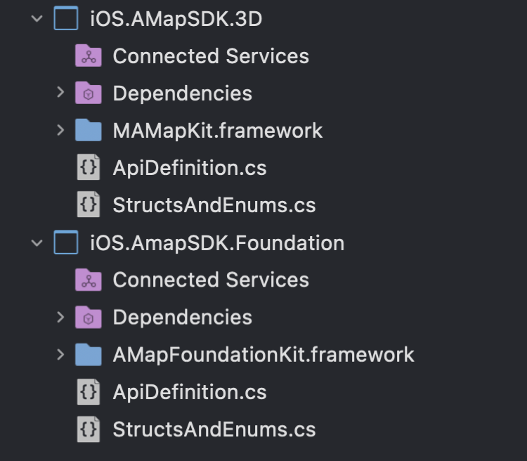
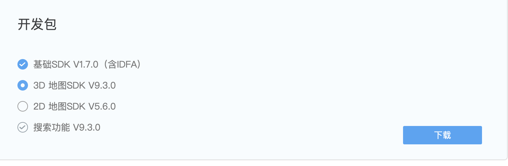
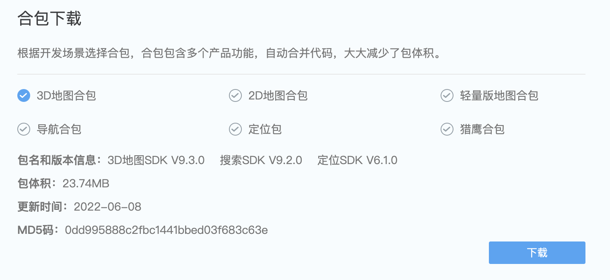
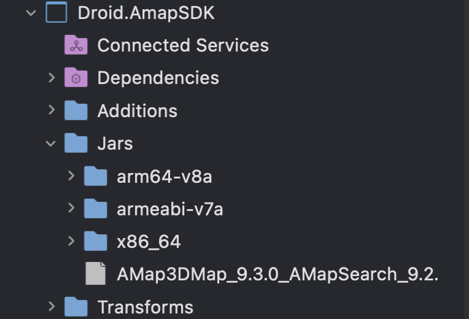
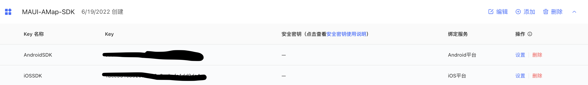

# **AutoNavi Map SDK For .NET MAUI (Android / iOS) Native Control Example**

.NET MAUI is a cross-platform application solution. If you have good knowledge of C# and .NET, you can use MAUI to complete the development of iOS , Android , Windows , Linux , macOS. This example is completed by .NET binding the native library. Taking the SDK provided by AutoNavi as an example, I hope to give developers and manufacturers some inspiration when developing .NET MAUI applications and controls.
 
 

## **Download AutoNavi Maps SDK for iOS and For Android**
 

### **Learn about the iOS SDK** https://developer.amap.com/api/ios-sdk/gettingstarted
 

### **Learn about the Android SDK** https://developer.amap.com/api/android-sdk/gettingstarted
 

### **Note the version compiled this time**
 

The SDKs used for iOS include AutoNavi Map iOS SDK (3D Map) V9.3.0 - MAMapKit.framework , AutoNavi Map iOS SDK (Basic SDK) V1.7 - AMapFoundationKit.framework

 

 

**download link**

https://lbs.amap.com/api/ios-sdk/download/
 

After downloading, put MAMapKit.framework and AMapFoundationKit.framework in the root directories of iOS.AMap.3D and iOS.AMap.Foundation respectively.

 

The SDKs used by Android are AutoNavi Map Android SDK (3D Map) / AutoNavi Map Android SDK (Search) V9.2.0 / - AMap3DMap_9.3.0_AMapSearch_9.2.0_AMapLocation_6.1.0_20220608.jar

**download link**

https://lbs.amap.com/api/android-sdk/download/
 

 

After downloading, put the jar and the corresponding arm64-v8a / armeabi-v7a / x86_64 into the Jars folder of Droid.AMapSDK
 

 

Don't forget to set the ID and application signature corresponding to the SDK in the AutoNavi console

 

 

## **run**
 

Please use device (not emulator) to run, now it is just a simple binding, thank you for your support.

 

## **Tutorial**

**1. Build MAUI control for AutoNavi map  - Preface**

https://github.com/kinfey/AMapMAUIControls/blob/main/tutorial/en/00.Intro.md

**2. Build MAUI control for AutoNavi map  - iOS Native Binding**

https://github.com/kinfey/AMapMAUIControls/blob/main/tutorial/en/01.iOSBinding.md

**3. Build MAUI control for AutoNavi map  - Android Native Binding**

https://github.com/kinfey/AMapMAUIControls/blob/main/tutorial/en/02.DroidBinding.md

**4. Build MAUI control for AutoNavi map  - Custom Controls**

https://github.com/kinfey/AMapMAUIControls/blob/main/tutorial/en/03.UIControls.md

# **高德地图 SDK For .NET MAUI ( Android / iOS ) 原生控件示例**

.NET MAUI 是跨平台应用的解决方案，如果你具备 C# 和 .NET 的前端知识，就可以通过 MAUI 来完成 iOS , Android , Windows , Linux , macOS 的开发。 本示例是通过 .NET 绑定原生库来完成，以高德地图提供的 SDK 为例， 希望给到开发者和厂商在开发 .NET MAUI 应用和控件时的一些启发。
 
 

## **下载高德地图 For iOS 和 For Android 的 SDK**
 

### **了解 iOS SDK**  https://developer.amap.com/api/ios-sdk/gettingstarted
 

### **了解 Android SDK**  https://developer.amap.com/api/android-sdk/gettingstarted
 

### **注意本次编译的版本**
 

iOS 用到的 SDK 有高德地图iOS SDK(3D地图) V9.3.0 - MAMapKit.framework , 高德地图 iOS SDK(基础SDK) V1.7 - AMapFoundationKit.framework 

 

 

**下载地址**

https://lbs.amap.com/api/ios-sdk/download/
 

下载后，把 MAMapKit.framework ，AMapFoundationKit.framework  分别放到 iOS.AMap.3D , iOS.AMap.Foundation 根目录下

 

Android 用到的 SDK 有高德地图Android SDK(3D地图) / 高德地图Android SDK(搜索)  V9.2.0  /   - AMap3DMap_9.3.0_AMapSearch_9.2.0_AMapLocation_6.1.0_20220608.jar 

**下载地址**

https://lbs.amap.com/api/android-sdk/download/
 

 

下载后，把jar 和对应的 arm64-v8a / armeabi-v7a / x86_64 放到 Droid.AMapSDK 的 Jars 文件夹
 

 

别漏了把 SDK 对应的 ID 和应用程序签名在高德控制台中设定好

 

 

## **运行**
 

请使用真机运行，现在只是简单绑定，谢谢支持。

 

## **教程**

**1. 做一个高德地图的 iOS / Android MAUI 控件(前言)**

https://github.com/kinfey/AMapMAUIControls/blob/main/tutorial/cn/00.Intro.md

**2. 做一个高德地图的 iOS / Android MAUI 控件(iOS 原生库绑定)**

https://github.com/kinfey/AMapMAUIControls/blob/main/tutorial/cn/01.iOSBinding.md

**3. 做一个高德地图的 iOS / Android MAUI 控件(Android 原生库绑定)**

https://github.com/kinfey/AMapMAUIControls/blob/main/tutorial/cn/02.DroidBinding.md

**4. 做一个高德地图的 iOS / Android MAUI 控件(创建控件)**

https://github.com/kinfey/AMapMAUIControls/blob/main/tutorial/cn/03.UIControls.md

