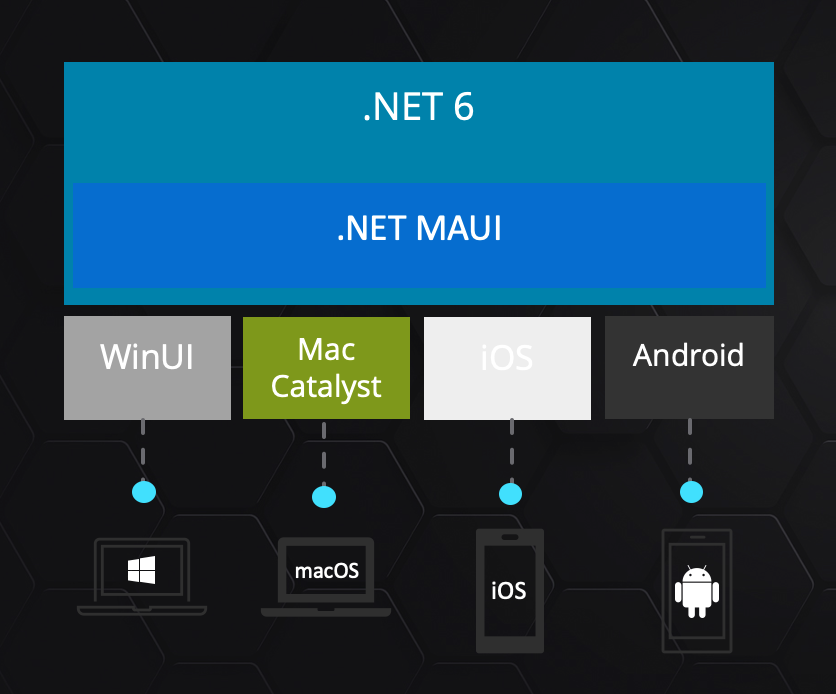
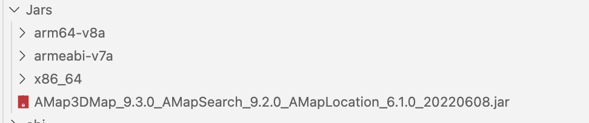
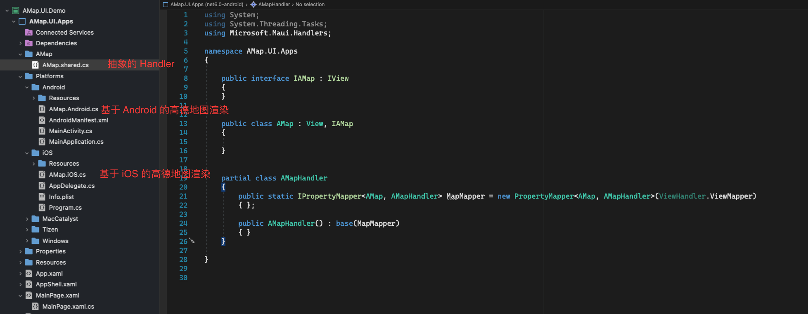
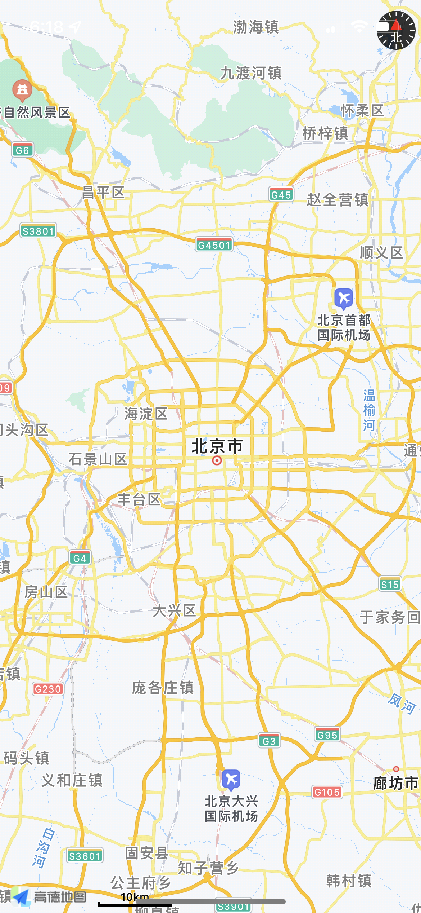

# **跟我做一个高德地图的 iOS / Android MAUI 控件(前言)**

Microsoft Build 2022 大会上正式发布了 .NET MAUI , 对于 .NET 开发者可以用 C# 完成跨平台的前端应用开发。对比起 MAUI 的前身 Xamarin , MAUI 除了可以用传统的原生开发模式外，还支持了 Blazor 的混合式开发。这也让更多方向的开发人员能进入到跨平台的应用开发中来。有人会提出云原生时代，前端开发还重要吗 ？实际上，多端应用兼容是云原生不可缺少的门面。互联网时代，有很多出色的应用，并发布了针对第三方应用的 SDK，开发者可以结合这些 SDK 做相关的解决方案。通过 MAUI 能调用这些 SDK 吗？ 我会通过系列文章去和大家介绍。作为该系列的开篇，我先来介绍一下需要掌握的技能, 让大家有所准备。
<br/>
<br/>


<br/>
<br/>

## **为何要绑定原生 SDK**
<br/>

我们知道一个应用可以融入不同的场景，例如一个打车应用就需要地图，例如一个拍照应用就需要社交，例如一个如果你是传统的物联网应用你需要一个蓝牙的通信协议。拿来主义就是一个节省的方式，可以结合第三方提供的 SDK 来完成应用的开发。对于 .NET 开发人员会是一个难点，因为习惯性地去调用 DLL ，但在 iOS / Android 原生开发上，实际上是有不同的库调用机制。在 Xamarin 时代，就有不少开发者去用 C# 绑定第三方的库，例如在中国市场就有支付宝，微信，高德地图等。到了 MAUI 有什么不一样呢？在大致上是和 Xamarin 绑定方式一样。但由于 MAUI 融入到了 .NET 6，实际上就是一个项目文件格式的改变。现阶段你可以通过命令行的方式快速构建 iOS / Android 的绑定项目。
<br/>

**MAUI iOS 库的绑定**
<br/>
<br/>


```bash

dotnet new iosbinding -o iOS.AMapSDK.Binding

```
<br/>

要做 iOS / macOS的绑定你除了创建绑定项目外，你还需要安装 Shapie 工具 (https://aka.ms/objective-sharpie) 做对应转换, 可以通过命令行去针对 iOS 的动态库和静态库做对应转换。这里补充一点你的 Xcode 环境是必须要安装的。下面是一个简单的转换语句，更多具体大家可以关注我的该系列的 iOS 库文件绑定文章。

<br/>

```bash

sharpie bind -framework /your path/AMapFoundationKit.framework -sdk iphoneos15.5

```

<br/>


**MAUI Android 库的绑定**
<br/><br/>

```bash

dotnet new android-bindinglib -o Droid.AMapSDK.Binding

```

Android 的绑定和 iOS 不一样，直接把第三方库 Android SDK 的 jar 或者 aar 包放进去编译即可。
<br/>
<br/>


<br/>
<br/>

如果你希望了解更多可以关注本系列 Android 库绑定的系列文章。
<br/>
<br/>

## **控件定制**
<br/>

在 Xamarin.Forms 中，通过渲染器机制对跨平台各自控件的引用，并且依赖于 INotifyPropertyChanged 。 .NET MAUI 没取消了渲染器机制，而是引入了一种称为 Handler 的模式。有了 Handlers 更灵活 ，而且在需要时更容易扩展或覆盖。 

这是 MAUI 全新的 Handler 模式
<br/>
<br/>


<br/>
<br/>

我们通过 Handler 机制可以构建好高德地图的 MAUI 控件
<br/>
<br/>


<br/>
<br/>

你可以通过 https://github.com/kinfey/AMapMAUIControls 使用体验 MAUI 的高德 Android / iOS 控件


<br/>

&nbsp; &nbsp;&nbsp;&nbsp;&nbsp;   
<br/>
<br/>

## **后记**
<br/>

本次系列的发布是希望有更多的厂商和开发者能够针对 MAUI 开发相关的控件和基于 MAUI 的 SDK 。我知道现在跨平台开发都有 Flutter , ReactNative 等。但 MAUI 是一个非常值得投入的解决方案，从性能和开发效率都是有竞争性的。我知道传统行业有非常多的 .NET 开发者， MAUI 会为传统行业的数字化转型提供非常好的体验。

### **相关资料**
<br/>


1. 通过 Microsoft Docs 了解 MAUI https://aka.ms/Docs.MAUI 
<br/>

2. 通过 Microsoft Learn 学习 MAUI https://aka.ms/Learn.MAUI


