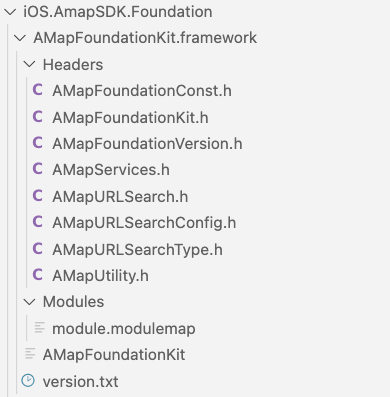
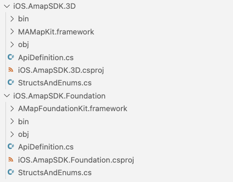
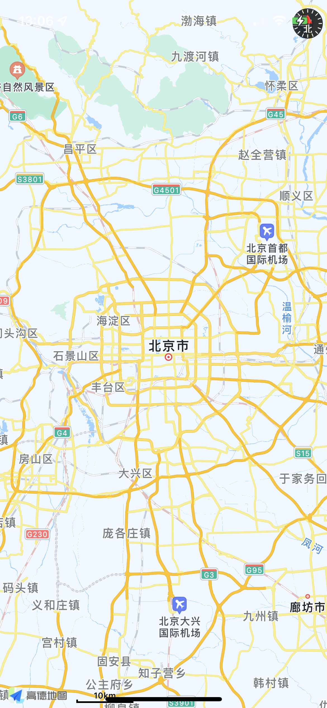

# **CA周记 - 跟我做一个高德地图的 iOS / Android MAUI 控件(iOS 原生库绑定)**

上篇介绍了一些做高德地图的 iOS / Android MAUI 控件的主要知识。而今天我会重点介绍 iOS 原生库绑定的知识， 并告诉大家在绑定原生库过程的一些技巧，希望给到小伙伴一些启发。
<br/>

## **认识 iOS 动态库和静态库**
<br/>

在绑定之前，我们需要学习一下 iOS 的动态库和静态库。最简单理解的方式是在 iOS 中静态库是以 .a 后缀结尾，动态库是以 .dylib 后缀结尾。无论静态库和动态库都可以打包成 Framework 。

**静态库和动态库的区别**

1. 静态库的特点是编译时会把库文件直接拷贝一份到目标应用程序，而这个拷贝是驻留在目标应用程序里面的，所以编译完成后，静态库的文件就没有用了。但有个缺点就是，因为需要拷贝，所以生成的应用程序的容量会较大

2. 动态库和静态库刚好是相反，编译的时候是不会拷贝到目标应用程序里面的，所以生成应用程序的体积较小，而且一个动态库可以共享给多个应用程序使用。但生成应用程序是依赖于动态库，这也导致经常会出现动态库找不到的情况。

我们来拆解一下高德地图基础的 SDK - AMapFoundationKit.framework
<br/>
<div style="text-align:center">

</div>
<br/>

这里就包含了对应的头文件信息，模块信息，以及静态库。你可以清晰看到高德地图打包成 Framrwork 的实现。这也是我们对库概念的认识，编译好的二进制代码，向外暴露头文件给第三方开发者使用。
<br/>


## **通过 Sharpie 工具生成 C# 调用的接口**
<br/>

Shapie 是一个非常好用的转换工具，它支持在 macOS 下对 Objective-C 的库的转。通过 Sharpie 可以对库文件给出的头文件进行转换完成 C# 的绑定。 在 MAUI 前身 Shapie 工具就已经存在 ， 我经常就利用这个工具做转换。

因为这次高德地图的功能我用到 3D ，所以我会对高德的 AMapFoundationKit.Framework 和 MAMapKit.framework 两个 Framework 进行绑定转换。
<br/>

**转换 AMapFoundationKit.Framework**
<br/>

```bash

sharpie bind -framework AMapFoundationKit.framework -sdk iphoneos15.5

```
<br/>

**转换 MAMapKit.framework**
<br/>

```bash

sharpie bind -framework MAMapKit.framework -sdk iphoneos15.5

```
<br/>

补充： MAMapKit.framework 依赖于 AMapFoundationKit.framework ，所以要放在一个相同的目录下。
<br/>


这里面要注意，你需要安装好 Xcode ，建议安装到最新 ，并对应最新的 iOS SDK , 当然你也可以根据需要绑定不同版本的 iOS SDK  , 你可以通过一次是命令查看环境
<br/>

```bash

sharpie xcode -sdks

```
<br/>

通过命令行绑定生成的是两个文件是 StructsAndEnums.cs 和 ApiDefinitions.cs ，StructsAndEnums.cs 对应的是一些常量和枚举类型， ApiDefinitions.cs 对应的是一些接口和方法 。

<br/>

## **创建 MAUI 的 iOS 绑定项目**
<br/>

这里创建需要注意，现在 Visual Studio 2022 的模版都没有完成，现在大家用命令行创建，因为我们有两个项目，需要创建两个 Binding 的项目分别是
<br/>

针对于 AMapFoundationKit.Framework 的项目构建
<br/>


```bash

dotnet new iosbinding -o iOS.AMap.Foundation

```
<br/>

针对于 MAMapKit.framework 的项目构建
<br/>

```bash

dotnet new iosbinding -o iOS.AMap.3D

```
<br/>

生成好后，需要把 AMapFoundationKit.framework 放到 iOS.AMap.Foundation 的目录下， MAMapKit.framework 放到 iOS.AMap.3D 目录下。并把生成的 StructsAndEnums.cs 和 ApiDefinitions.cs 放到对应目录。
<br/>
<div style="text-align:center">

</div>
<br/>

## **项目设置调整**
<br/>

1. 在 Sharpie 生成的目录下 StructsAndEnum.cs ，而在构建的 Binding 目录下是 ApiDefinition.cs ， 要把它替换掉。所以要对 .csproj 项目进行修改
<br/>

```xml

<ItemGroup>
    <ObjcBindingApiDefinition Include="ApiDefinitions.cs" />
    <ObjcBindingCoreSource Include="StructsAndEnums.cs" />
</ItemGroup>

```
<br/>

2. 对 iOS.AMap.Foundation 进行编译
<br/>

**在 AMapFoundationKit.framework.csproj 增加对 Framework 的引用**

```xml

  <ItemGroup>
    <NativeReference Include="AMapFoundationKit.framework">
      <Kind>Framework</Kind>
      <ForceLoad>True</ForceLoad>
      <SmartLink>False</SmartLink>
    </NativeReference>
  </ItemGroup>

```
<br/>

Kind ： 原生绑定类型可以是 Framwork 也可以是 StaticLibary

ForceLoad ： 强加载，选择 True

SmartLink ： 智能链接
<br/>

完成的项目.csproj 设置为


```xml

<Project Sdk="Microsoft.NET.Sdk">
  <PropertyGroup>
    <TargetFramework>net6.0-ios</TargetFramework>
    <Nullable>enable</Nullable>
    <ImplicitUsings>true</ImplicitUsings>
    <IsBindingProject>true</IsBindingProject>
		<AllowUnsafeBlocks>true</AllowUnsafeBlocks>
		<NoBindingEmbedding>false</NoBindingEmbedding>
  </PropertyGroup>

  <ItemGroup>
    <ObjcBindingApiDefinition Include="ApiDefinitions.cs" />
    <ObjcBindingCoreSource Include="StructsAndEnums.cs" />
  </ItemGroup>


  <ItemGroup>
    <NativeReference Include="AMapFoundationKit.framework">
      <Kind>Framework</Kind>
      <ForceLoad>True</ForceLoad>
      <SmartLink>False</SmartLink>
    </NativeReference>
  </ItemGroup>

</Project>


```

编译 iOS.AMap.Foundation ， 你会觉得奔溃，因为非常多的出错信息。这是因为 Shapie 做转换时，一些转换没做好导致的，这个时候你就需要一个一个进行调整
<br/>
<div style="text-align:center">

</div>
<br/>

**归类一下出错信息**

****The type or namespace name 'VerifyAttribute' could not be found***

这类信息时因为转换时候没有确认好属性，所以会增加 VerifyAttribute 字段，这个一般情况下把这个字段注释掉就可以了，如

```csharp

static class CFunctions
{
	// NSString * AMapEmptyStringIfNil (NSString *s);
	[DllImport ("__Internal")]
	// [Verify (PlatformInvoke)]
	static extern NSString AMapEmptyStringIfNil (NSString s);

	// extern CLLocationCoordinate2D AMapCoordinateConvert (CLLocationCoordinate2D coordinate, AMapCoordinateType type);
	[DllImport ("__Internal")]
	// [Verify (PlatformInvoke)]
	static extern CLLocationCoordinate2D AMapCoordinateConvert (CLLocationCoordinate2D coordinate, AMapCoordinateType type);

	// extern BOOL AMapDataAvailableForCoordinate (CLLocationCoordinate2D coordinate);
	[DllImport ("__Internal")]
	// [Verify (PlatformInvoke)]
	static extern bool AMapDataAvailableForCoordinate (CLLocationCoordinate2D coordinate);
}

```
<br/>


****The type or namespace name 'AMapFoundationKit'***

命名空间问题，这个你需要为 StructsAndEnums.cs 和 ApiDefinitions.cs 增加命名控件就可以了，你可以直接用 AMapFoundationKit ，也可以自己修改喜欢的名字 ，我这里用 iOS.AMap.Foundation 名字和项目对应
<br/>

****Duplicate 'Static' attribute***

这个是因为 ApiDefinitions.cs 的 Constants 重复定义了，这个就需要重新整理归并为一个就可以了
<br/>


****Unsupported type for Fields: bool for 'iOS.AMap.Foundation.Constants _amapLocationOverseas'.e***

类型不对应导致编译不通过，这个时候我修改为


```csharp

[Field ("_amapLocationOverseas", "__Internal")]
IntPtr _amapLocationOverseas { get; }

```

这样你就可以编译通过 iOS.AMap.Foundation 
<br/>


1. 对 iOS.AMap.3D 进行编译
<br/>

**添加对 iOS.AMap.Foundation的引用**

因为 MAMapKit.framework 依赖于 AMapFoundationKit.framework ， 所以 iOS.AMap.3D 是依赖于 iOS.AMap.Foundation 


```xml


  <ItemGroup>
    <ProjectReference Include="..\iOS.Amap.Foundation\iOS.Amap.Foundation.csproj" />
  </ItemGroup>

```
<br/>

**引入 MAMapKit.framework**


```xml


  <ItemGroup>
    <NativeReference Include="MAMapKit.framework">
      <Kind>Framework</Kind>
      <ForceLoad>True</ForceLoad>
      <SmartLink>True</SmartLink>
      <Frameworks>GLKit OpenGLES UIKit Foundation CoreGraphics QuartzCore CoreLocation CoreTelephony SystemConfiguration Security AdSupport JavaScriptCore</Frameworks>
      <LinkerFlags>-lz -lstdc++ -lc++</LinkerFlags>
    </NativeReference>
  </ItemGroup>

```

这个和 AMapFoundationKit.framework 不一样的， 需要添加 Framework 编译时需要依赖的项， 以及用到的编译方式 ，这个和你绑定的 framework 有关， 我这里选择高德地图，所以按照它们的文档要求做了相关设置。

完成的项目.csproj 设置为


```xml

<Project Sdk="Microsoft.NET.Sdk">
  <PropertyGroup>
    <TargetFramework>net6.0-ios</TargetFramework>
    <RootNamespace>iOS.Amap._3D</RootNamespace>
    <Nullable>enable</Nullable>
    <ImplicitUsings>true</ImplicitUsings>
    <IsBindingProject>true</IsBindingProject>
		<AllowUnsafeBlocks>true</AllowUnsafeBlocks>
		<NoBindingEmbedding>false</NoBindingEmbedding>
  </PropertyGroup>
  <ItemGroup>
    <ObjcBindingApiDefinition Include="ApiDefinitions.cs" />
    <ObjcBindingCoreSource Include="StructsAndEnums.cs" />
  </ItemGroup>
  <ItemGroup>
    <NativeReference Include="MAMapKit.framework">
      <Kind>Framework</Kind>
      <ForceLoad>True</ForceLoad>
      <SmartLink>True</SmartLink>
      <Frameworks>GLKit OpenGLES UIKit Foundation CoreGraphics QuartzCore CoreLocation CoreTelephony SystemConfiguration Security AdSupport JavaScriptCore</Frameworks>
      <LinkerFlags>-lz -lstdc++ -lc++</LinkerFlags>
    </NativeReference>
  </ItemGroup>

  <ItemGroup>
    <ProjectReference Include="..\iOS.Amap.Foundation\iOS.Amap.Foundation.csproj" />
  </ItemGroup>
</Project>

```
<br/>

编译 iOS.AMap.3D，你会比之前更奔溃，这个时候你需要有足够的耐心， 除了和之前差不多的出错信息外，还有一些新的状况，我这里列举一下

****Type 'MAMapViewDelegate' already defines a member called 'MapView' with the same parameter types***

造成这个原因是因为方法重名了，这也是 Objective-C 声明式语法和传统语法不一样的地方，所以你要针对这个做重命名

如这个 

```csharp

// @optional -(void)mapView:(MAMapView *)mapView didAnnotationViewTapped:(MAAnnotationView *)view;
[Export ("mapView:didAnnotationViewTapped:")]
void MapView (MAMapView mapView, MAAnnotationView view);

```

修改为

```csharp

// @optional -(void)mapView:(MAMapView *)mapView didAnnotationViewTapped:(MAAnnotationView *)view;
[Export ("mapView:didAnnotationViewTapped:")]
void MapViewDidAnnotationViewTapped (MAMapView mapView, MAAnnotationView view);

```

****The type or namespace name 'IMAOverlay' could not be found***

这个是命名出错，在 ApiDefinitions.cs 文件中你可以找到 MAOverlay


```csharp


[Protocol]
interface MAOverlay : IMAAnnotation
{
		// @required -(CLLocationCoordinate2D)coordinate;
	[Abstract]
	[Export ("coordinate")]
	// [Verify (MethodToProperty)]
	CLLocationCoordinate2D Coordinate { get; }

	// @required -(MAMapRect)boundingMapRect;
	[Abstract]
	[Export ("boundingMapRect")]
	// [Verify (MethodToProperty)]
	MAMapRect BoundingMapRect { get; }
}


```

所以把所有 IMAOverlay 替换为 MAOverlay 即可。

****The type or namespace name 'AutoGeneratedName' could not be found***

把 AutoGeneratedName 取消

****Constant value '-1' cannot be converted to a 'ulong'***

指定类型错误 AllCorners = ～0x0 改为 AllCorners = 0x0

****Do not know how to make a signature for CoreLocation.CLLocationCoordinate2D* in parameter `coordinates'***

C# 是没有指针的，在 Sharpie 转换时出错了

****'MAMapView_UserLocation.HeadingFilter': cannot declare instance members in a static class***


```csharp

// @property (nonatomic) CLLocationDegrees headingFilter;
[Export ("headingFilter")]
double HeadingFilter( { get; set; })

```

这个定义要换成

```csharp

// @property (nonatomic) CLLocationDegrees headingFilter;
[Export ("headingFilter")]
double HeadingFilter();

```

****Cannot convert type 'Foundation.NSObject' to 'nint'***


```csharp

// @property (nonatomic, weak) id<MAOverlayRenderDelegate> rendererDelegate;
[NullAllowed, Export ("rendererDelegate", ArgumentSemantic.Weak)]
NSObject WeakRendererDelegate { get; set; }

```

修改为 

```csharp

// @property (nonatomic, weak) id<MAOverlayRenderDelegate> rendererDelegate;
[NullAllowed, Export ("rendererDelegate", ArgumentSemantic.Weak)]
IntPtr WeakRendererDelegate { get; set; }

```

或者排除是一个漫长的过程，但编译成功一刻你会非常兴奋，这样我们就把 AMapFoundationKit.framework 和 MAMapKit.framework 绑定成功了。

<br/>


## **尝试创建一个 .NET for iOS  项目验证一下**
<br/>
<br/>
<div style="text-align:center">

</div>
<br/>

具体实现请到我的 GitHub Repo 下载 ： https://github.com/kinfey/AMapMAUIControls/tree/main/Samples/iOS.Bindings/AMap.iOS.Demo 
<br/>


## **小结**
<br/>

原生库绑定虽然比较多繁琐的事情，但是实际上也是十分治愈的，当你看到编译通过的那一刻，你就会明白个中的快乐。还有一点，很多人认为跨平台移动开发不需要平台的基础知识了，实际还是需要。特别在这种原生库的绑定上，就需要你既会 C# 又会 Objective-C 。希望该例子能给各位有所启发。请大家期待下一篇。
<br/>


### **相关资料**
<br/>


1. 通过 Microsoft Docs 了解 MAUI https://aka.ms/Docs.MAUI 
2. 通过 Microsoft Learn 学习 MAUI https://aka.ms/Learn.MAUI
3. 使用高德地图 SDK for iOS 请访问 https://developer.amap.com/api/ios-sdk/gettingstarted
4. 了解 iOS 原生库绑定的内容，请访问 https://docs.microsoft.com/zh-cn/xamarin/cross-platform/macios/binding/?context=xamarin%2Fios 


