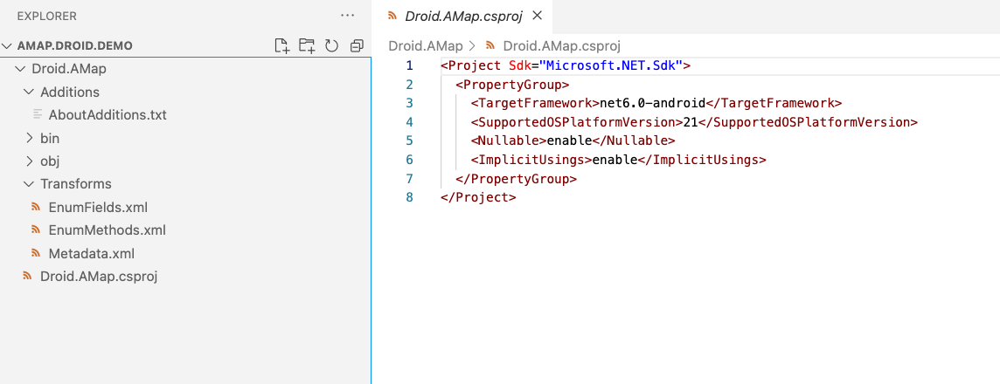
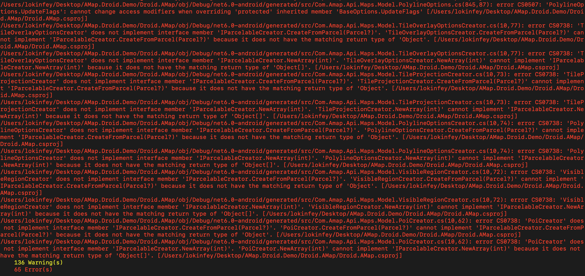
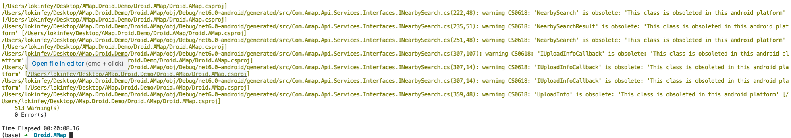

# **做一个高德地图的 iOS / Android MAUI 控件(Android 原生库绑定)**

我们已经介绍了如何通过 .NET 绑定 iOS 原生库 ，本篇开始介绍一下如何通过 .NET 绑定 Android 原生库。

## **Android 的库**

Android 的库以 .jar 做打包， 通过工具你可以将多个 .jar 完成绑定，然后通过 C# 调用原生的 Java 库。对比起 iOS ， Android 的库绑定简单很多。


<br/>

从上图可以看到 Xamarin.Android / .NET for Android 通过使用托管可调用包装器 (MCW) 实现绑定。 MCW 是一个 JNI 桥，在托管代码需要调用 Java 代码时会使用它。 托管可调用包装器还支持对 Java 类型进行子类化以及覆盖 Java 类型的虚拟方法。 同样，每当 Android 运行时 (ART) 代码需要调用托管代码时，它都会通过另一个称为 Android 可调用包装器 (ACW) 的 JNI 桥来实现。
<br/>


## **创建一个 Android 原生库绑定项目**

通过命令行创建一个 Android 原生库绑定项目

```bash

dotnet new android-bindinglib -o Droid.AMap

```

进入该项目我们看看文件结构


<br/>

项目里面有 Transforms 文件夹有对应的三个 xml 文件，分别是 EnumFields.xml ，EnumMethods.xml , Metadata.xml ,  各自作用如下 ：

**MetaData.xml** – 允许对最终 API 进行更改，例如更改生成的绑定的命名空间。

**EnumFields.xml** – 包含 Java int 常量与 C# enums 之间的映射。

**EnumMethods.xml** – 允许将方法参数和返回类型从 Java int 常量更改为 C# enums 

其中 MetaData.xml 文件是这些文件中的最常见的导入，因为它允许对绑定进行一般用途的更改，例如：

重命名命名空间、类、方法或字段，使其遵循 .NET 约定。

删除不需要的命名空间、类、方法或字段。

将类移到不同的命名空间。

添加其他支持类以使绑定的设计遵循 .NET 框架模式。

***把  jar 文件添加到绑定项目***

在项目中添加 Jars 目录 ，把高德地图的 jar 包添加到该目录下 ，并把 arm64-v8a ，armeabi-v7a ，x86_64 这三个目录添加进来


<br/>

添加完成后，修改 .csproj 文件

```xml

<Project Sdk="Microsoft.NET.Sdk">
  <PropertyGroup>
    <TargetFramework>net6.0-android</TargetFramework>
    <SupportedOSPlatformVersion>21</SupportedOSPlatformVersion>
    <Nullable>enable</Nullable>
    <ImplicitUsings>enable</ImplicitUsings>
  </PropertyGroup>
  <ItemGroup>
    <EmbeddedNativeLibrary Include="Jars\arm64-v8a\libAMapSDK_MAP_v9_3_0.so" />
    <EmbeddedNativeLibrary Include="Jars\armeabi-v7a\libAMapSDK_MAP_v9_3_0.so" />
    <EmbeddedNativeLibrary Include="Jars\x86_64\libAMapSDK_MAP_v9_3_0.so" /> 
  </ItemGroup>
  <ItemGroup>
    <TransformFile Include="Transforms\Metadata.xml" />
    <TransformFile Include="Transforms\EnumFields.xml" />
    <TransformFile Include="Transforms\EnumMethods.xml" />
  </ItemGroup>
  <ItemGroup>
    <EmbeddedJar Include="Jars\AMap3DMap_9.3.0_AMapSearch_9.2.0_AMapLocation_6.1.0_20220608.jar" />
  </ItemGroup>
</Project>


```

这样就把项目添加好了，没有像 iOS 原生库绑定那么繁琐。然后编译一下 ，凡尔赛 + 星辰大海了


<br/>


## **排雷工作**

看见这么多错，真的要考虑一下是不是放弃，其实这也非常治愈，我们逐个来排雷。

****'PoiCreator' does not implement interface member 'IParcelableCreator.NewArray(int)'. 'PoiCreator.NewArray(int)' cannot implement 'IParcelableCreator.NewArray(int)'***

错误对应的是这个方法 ,实际就是返回类型出错了，我们先根据源文件看看 path 路径就可以解决

```java


// Metadata.xml XPath method reference: path="/api/package[@name='com.amap.api.maps.model']/class[@name='PoiCreator']/method[@name='newArray' and count(parameter)=1 and parameter[1][@type='int']]"
[Register ("newArray", "(I)[Lcom/amap/api/maps/model/Poi;", "GetNewArray_IHandler")]
public virtual unsafe global::Com.Amap.Api.Maps.Model.Poi[]? NewArray (int p0)
{
	const string __id = "newArray.(I)[Lcom/amap/api/maps/model/Poi;";
	try {
			JniArgumentValue* __args = stackalloc JniArgumentValue [1];
			__args [0] = new JniArgumentValue (p0);
			var __rm = _members.InstanceMethods.InvokeVirtualObjectMethod (__id, this, __args);
			return (global::Com.Amap.Api.Maps.Model.Poi[]?) JNIEnv.GetArray (__rm.Handle, JniHandleOwnership.TransferLocalRef, typeof (global::Com.Amap.Api.Maps.Model.Poi));
			} finally {
	}
    
}

```

确认好后，需要在 Metadata.xml 做添加

```xml

<attr path="/api/package[@name='com.amap.api.maps.model']/class[@name='PoiCreator']/method[@name='newArray' and count(parameter)=1 and parameter[1][@type='int']]" name="managedReturn">Java.Lang.Object[]</attr>

```

****The type 'AMap' already contains a definition for 'MarkerDragEnd'***

这个是重复定义导致的，只需要添加如下代码删除就可以了，如


```xml

 <remove-node path="/api/package[@name='com.amap.api.maps']/interface[@name='AMap.OnCameraChangeListener']" />

```

****'BusLineSearch': member names cannot be the same as their enclosing type***

重命名导致的错误 ，把名字修改一下即可，如

```xml

<attr path="/api/package[@name='com.amap.api.services.busline']/class[@name='BusLineSearch']" name="managedName">AmapBusLineSearch</attr>

```

****cannot change access modifiers when overriding 'protected'***

重载的时候出现权限问题，这个时候你需要的是把权限修正好，如

```xml

<attr path="/api/package[@name='com.amap.api.maps.model']/class[@name='PolygonOptions']/method[@name='getUpdateFlags' and count(parameter)=0]" name="visibility">protected</attr>

```

解决上述的所有问题，基本上就可以治愈了，当编译通过一刻你会非常兴奋



<br/>


## **找个 .NET for Android 项目看看**
<br/>
<div style="text-align:center">

</div>
<br/>

大家可以去我的 GitHub 下载该示例 https://github.com/kinfey/AMapMAUIControls/tree/main/samples/Droid.Bindings


## **小结**
<br/>

Android 的原生绑定比 iOS 的简单得多，所以更容易入手。希望各位小伙伴能多动手，有时候也是一个很好的体验。经过两篇文章的学习，相信大家也掌握了如何用 .NET 绑定 iOS 和 Android 的原生库了。最后一篇文章我们来讨论下如何做一个适配 MAUI 的原生控件
<br/>


### **相关资料**
<br/>


1. 通过 Microsoft Docs 了解 MAUI https://aka.ms/Docs.MAUI 
2. 通过 Microsoft Learn 学习 MAUI https://aka.ms/Learn.MAUI
3. 使用高德地图 SDK for iOS 请访问 https://developer.amap.com/api/ios-sdk/gettingstarted
4. 了解 Android 原生库绑定的内容，请访问 https://docs.microsoft.com/en-us/xamarin/android/platform/binding-java-library/

