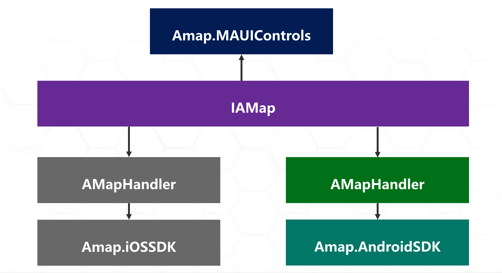
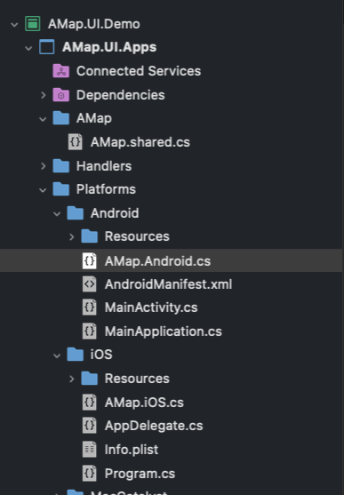

# **做一个高德地图的 iOS / Android MAUI 控件(创建控件)**

我们知道 MAUI 是开发跨平台应用的解决方案 ，用 C# 可以直接把 iOS , Android , Windows , macOS , Linux ,Tizen 等应用开发出来。那我们在这个框架除了用底层自定义的 UI 控件外，如果我们要用如高德地图这样的第三方控件，要如何做呢？接下来我就和大家介绍一下。

如果你还没有学习原生库绑定的知识，可以到以下链接学习相关内容：

*关于做一个高德地图的 iOS / Android MAUI 控件(iOS 原生库绑定)*

https://github.com/kinfey/AMapMAUIControls/blob/main/tutorial/cn/01.iOSBinding.md 

*做一个高德地图的 iOS / Android MAUI 控件(Android 原生库绑定)*

https://github.com/kinfey/AMapMAUIControls/blob/main/tutorial/cn/02.DroidBinding.md

在上面两个例子中我们学习到把原生高德的 iOS / Android SDK 绑定，也用 .NET for iOS 和 .NET for Android 进行了调用。但要用 MAUI 就意味着调用方式改变， 一次性编写多平台使用。要实现这个效果，先看看 MAUI 的基础架构。
<br/>


<br/>

我们可以清楚看到， MAUI 除了公用的 xmal 文件外， 实际上也把特定平台的一些设定放置到 Platforms 的文件夹内， Platforms 的自文件夹就是对应的平台。 我们知道可以根据不同平台去渲染平台界面。这就是我们常说的自定义平台控件了。

在前言部分我们也提到了 MAUI 采用 Handler 模式去设定平台界面。如果我们要实现一个高德地图的 MAUI 控件，具体的架构是这样的
<br/>


<br/>

我们需要去创建如上图的一个结构，我们需要为 AMap 添加一个共享文件 AMap.shared.cs ，这个文件 AMapHandler 继自 ViewHandler。

```csharp

    public interface IAMap : IView
    {
    }


    public class AMap : View, IAMap
    {

    }


    partial class AMapHandler
    {
        public static IPropertyMapper<AMap, AMapHandler> MapMapper = new PropertyMapper<AMap, AMapHandler>(ViewHandler.ViewMapper)
        { };

        public AMapHandler() : base(MapMapper)
        { }
    }

```

然后在 Platforms 下的 Android 和 iOS 文件夹添加各自的平台 AMap 调用方法。
<br/>
<div style="text-align:center">

</div>
<br/>


为 AMap.Android.cs 添加 Android 环境下高德地图的渲染方式


```csharp

namespace AMap.UI.Apps
{
    public partial class AMapHandler : ViewHandler<IAMap, MapView>
    {
        private AMapHelper _mapHelper;
        private MapView mapView;
        internal static Bundle Bundle { get; set; }

        public AMapHandler(IPropertyMapper mapper, CommandMapper commandMapper = null) : base(mapper, commandMapper)
        {
        }


        protected override MapView CreatePlatformView()
        {

            mapView = new Com.Amap.Api.Maps.MapView(Context);
            return mapView;
        }

        protected override void ConnectHandler(MapView platformView)
        {
            base.ConnectHandler(platformView);


            AMapLocationClient.UpdatePrivacyAgree(Context, true);
            AMapLocationClient.UpdatePrivacyShow(Context, true, true);

            _mapHelper = new AMapHelper(Bundle, platformView);
            mapView = _mapHelper.CallCreateMap();
        }
    }


    class AMapHelper : Java.Lang.Object
    {

        private Bundle _bundle;
        private MapView _mapView;

        public event EventHandler MapIsReady;

        public MapView Map { get; set; }

        public AMapHelper(Bundle bundle, MapView mapView)
        {
            _bundle = bundle;
            _mapView = mapView;
        }

        public MapView CallCreateMap()
        {
            
            _mapView.OnCreate(_bundle);
            return _mapView;
        }


    }

}

```
<br/>


为 AMap.iOS.cs 添加 iOS 环境下高德地图的渲染方式

```csharp

namespace AMap.UI.Apps
{
    public partial class AMapHandler : ViewHandler<IAMap, MAMapView>
    {
        public AMapHandler(IPropertyMapper mapper, CommandMapper commandMapper = null) : base(mapper, commandMapper)
        {
        }

        protected override MAMapView CreatePlatformView()
        {
            MAMapView.UpdatePrivacyShow(AMapPrivacyShowStatus.DidShow, AMapPrivacyInfoStatus.DidContain);
            MAMapView.UpdatePrivacyAgree(AMapPrivacyAgreeStatus.DidAgree);


            AMapServices.SharedServices.ApiKey = "";
            AMapServices.SharedServices.EnableHTTPS = true;

            //try
            //{

            MAMapView map = new MAMapView();
            map.SetShowsUserLocation(true);
            map.SetUserTrackingMode(MAUserTrackingMode.Follow);

            return map;
        }

        protected override void ConnectHandler(MAMapView PlatformView)
        { }

        protected override void DisconnectHandler(MAMapView PlatformView)
        {
            if (PlatformView.Delegate != null)
            {
                PlatformView.Delegate.Dispose();
                PlatformView.Delegate = null;
            }

            PlatformView.RemoveFromSuperview();
        }
    }


}

```
<br/>

这里我们要修改 MAUI 的项目文件，这里有几个设定需要注意的

1. 因为这个控件只是针对 iOS / Android 两个平台，所以我们只保留 net6.0-android 和 net6.0-ios

2. 高德 SDK 运行建议在真机下使用，特别是 iOS ，需要制定版本号，还有编译环境，我的环境是在 Apple silicon 下所以也要设定好 RuntimeIdentifier，还有就是编译的时候，我花了特别多时间在这里，大家可以参考我这个在 GitHub 上自问自答的 Issue https://github.com/xamarin/xamarin-macios/issues/15372

```xml

   <PropertyGroup Condition="$(TargetFramework.Contains('-ios'))">
        <RuntimeIdentifier>ios-arm64</RuntimeIdentifier>
        <UseMSBuildEngine>true</UseMSBuildEngine>
        <WarningLevel>4</WarningLevel>
        <MtouchLink>SdkOnly</MtouchLink>
        <SupportedOSPlatformVersion>13.0</SupportedOSPlatformVersion>
        <DeviceSpecificBuild>true</DeviceSpecificBuild>
        <MtouchDebug>true</MtouchDebug>
        <MtouchFastDev>true</MtouchFastDev>
        <MtouchProfiling>true</MtouchProfiling>
        <MtouchUseSGen>true</MtouchUseSGen>
        <MtouchUseRefCounting>true</MtouchUseRefCounting>
        <MtouchFloat32>true</MtouchFloat32>
   </PropertyGroup> 

```

3. 记得按照平台引入原生库的绑定


```xml


  <ItemGroup Condition=" '$(TargetPlatformIdentifier)' == 'ios' ">
    <ProjectReference Include="..\iOS.AmapSDK.Foundation\iOS.AmapSDK.Foundation.csproj" /> 
    <ProjectReference Include="..\iOS.AmapSDK.3D\iOS.AmapSDK.3D.csproj" /> 
  </ItemGroup>
  
  <ItemGroup Condition=" '$(TargetPlatformIdentifier)' == 'android' ">
    <ProjectReference Include="..\Droid.AmapSDK\Droid.AmapSDK.csproj" /> 
  </ItemGroup>

```

**查看完整项目文件，请点击该链接** 

https://github.com/kinfey/AMapMAUIControls/blob/main/src/AMap.UI.Demo/AMap.UI.Apps/AMap.UI.Apps.csproj

也别忘记去把一些平台特有的设定设置好，具体可以

*iOS 设定请点击该链接*

https://github.com/kinfey/AMapMAUIControls/blob/main/src/AMap.UI.Demo/AMap.UI.Apps/Platforms/iOS/Info.plist


*Android 设定请点击该链接*

https://github.com/kinfey/AMapMAUIControls/blob/main/src/AMap.UI.Demo/AMap.UI.Apps/Platforms/Android/AndroidManifest.xml

最后一步就是在 MauiProgram.cs 上注册

```csharp

builder
	.UseMauiApp<App>()
	.ConfigureFonts(fonts =>
	{
		fonts.AddFont("OpenSans-Regular.ttf", "OpenSansRegular");
		fonts.AddFont("OpenSans-Semibold.ttf", "OpenSansSemibold");
	})
    .ConfigureMauiHandlers(handlers =>
    {
        handlers.AddHandler(typeof(AMap), typeof(AMapHandler));
	});

```
<br/>

选择编译运行就可以看到高德地图终于可以在 MAUI 环境下跑起来了


<br/>

<div style="text-align:center">
&nbsp; &nbsp;&nbsp;&nbsp;&nbsp;   
</div>
<br/>


## **小结**
<br/>

对于很多人来说或者都是初步接触了 MAUI ，实际上要做好多平台的兼容还要有非常长的路要走。希望通过这个系列的文章，能给一些第三方厂商和开发者一些帮助，能尽快提供 MAUI 的支持。这样才能为这个新的技术注入活力。


### **相关资料**
<br/>


1. 通过 Microsoft Docs 了解 MAUI https://aka.ms/Docs.MAUI 
2. 通过 Microsoft Learn 学习 MAUI https://aka.ms/Learn.MAUI
3. 学习 ViewHandler 自定义 MAUI组件 请点击访问该链接 https://docs.microsoft.com/zh-cn/dotnet/maui/user-interface/handlers/customize


