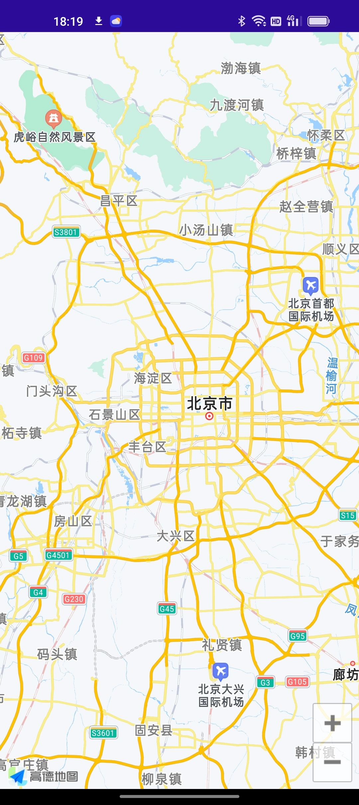

# **Build MAUI control for AutoNavi map  - Preface**

At Microsoft Build 2022 , .NET MAUI was officially released. For .NET developers, C# can be used to complete cross-platform front-end application development. Compared with MAUI's predecessor - Xamarin, MAUI supports Blazor's hybrid development in addition to the traditional native development mode. This allows developers from more tech areas to take part in cross-platform application development. Someone would wonder whether front-end development is still important in the cloud-native era. In fact, multi-terminal application compatibility is an indispensable aspect of cloud native. In the Internet era, there are many excellent applications and SDKs for third-party applications that have been released. Developers can combine these SDKs to find related solutions and publish apps. Can these SDKs be called through MAUI? I will introduce it to you through a series of articles. At the beginning of this series, let me introduce the skills that need to be mastered so that everyone can be prepared.
<br/>
<br/>


<br/>
<br/>

## **Why need to bind native SDK ?**
<br/>

We know that an application can be integrated into different scenarios. For example, a taxi-hailing application needs a map, for example, a camera application needs to be socialized. For example, if you are a traditional Internet of Things application, you need a Bluetooth communication protocol. Bringing doctrine is a way of saving, which can be combined with the SDK provided by the third party to complete the development of the application. It will be difficult for .NET developers, because it is habitual to call DLLs, but in iOS / Android native development, there are actually different library calling mechanisms. In the Xamarin era, many developers used C# to bind third-party libraries, such as Alipay, WeChat, AutoNavi Maps, etc. in the Chinese market. What is the difference when it comes to MAUI? It's roughly the same as the Xamarin bindings. But since MAUI is integrated into .NET 6, it is actually a change in the project file format. At this stage, you can quickly build iOS / Android binding projects through the command line.
<br/>

**Bindings iOS Native Library for MAUI**
<br/>
<br/>


```bash

dotnet new iosbinding -o iOS.AMapSDK.Binding

```
<br/>

To binding iOS / macOS SDKs , in addition to creating a binding project, you also need to install the Shapie tool (https://aka.ms/objective-sharpie) to do the corresponding conversion, you can use the command line to target the iOS dynamic library and The static library does the corresponding conversion. Here's to add that your Xcode environment must be installed. The following is a simple conversion statement. For more details, you can pay attention to my series of iOS library file binding articles.

<br/>

```bash

sharpie bind -framework /your path/AMapFoundationKit.framework -sdk iphoneos15.5

```

<br/>


**Bindings Android Native Library for MAUI**
<br/><br/>

```bash

dotnet new android-bindinglib -o Droid.AMapSDK.Binding

```

The binding of Android is different from that of iOS. You can directly compile the jar or aar package of the third-party library Android SDK into it.
<br/>
<br/>


<br/>
<br/>

If you want to learn more, you can follow this series of articles on Android library bindings.
<br/>
<br/>

## **Custom Control**
<br/>

In Xamarin.Forms, a reference to the respective controls across platforms via the renderer mode and depends on INotifyPropertyChanged . .NET MAUI did not cancel the renderer mode, but introduced a pattern called Handler. With Handlers it is more flexible and easier to extend or override when needed.

This is MAUI's new Handler mode
<br/>
<br/>


<br/>
<br/>


You can use and experience MAUI's AutoNavi Android / iOS controls through https://github.com/kinfey/AMapMAUIControls


<br/>

&nbsp; &nbsp;&nbsp;&nbsp;&nbsp;   
<br/>
<br/>

## **Summary**
<br/>

The release of this series is to hope that more manufacturers and developers can develop related controls and MAUI-based SDKs for MAUI. I know that there are now Flutter, ReactNative for cross-platform development. But MAUI is a very worthwhile solution, which is competitive in terms of performance and development efficiency. I know that there are many .NET developers in traditional industries, and MAUI will provide a very good experience for the digital transformation of traditional industries.

### **More**
<br/>


1. Learn about MAUI through Microsoft Docs https://aka.ms/Docs.MAUI
<br/>

2. Learn MAUI through Microsoft Learn https://aka.ms/Learn.MAUI


