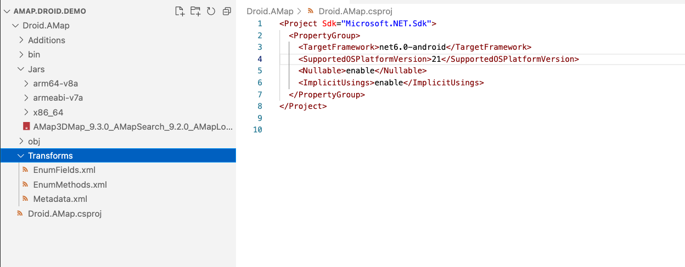
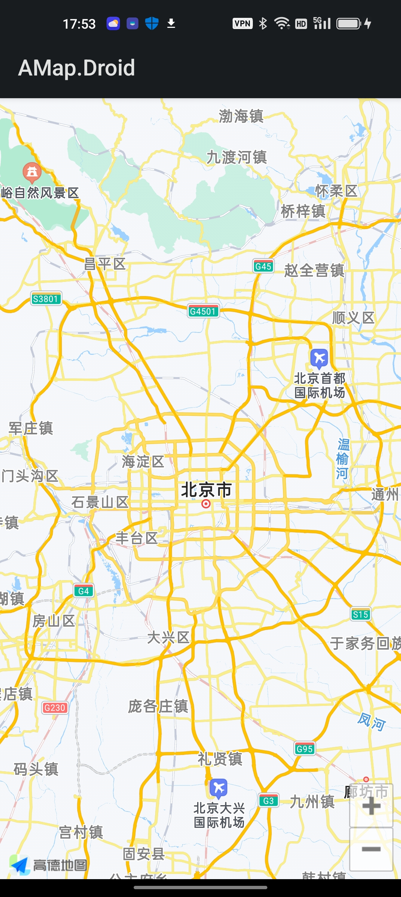

# **Build MAUI control for AutoNavi map  - Android Native Binding**

We have already introduced how to bind the iOS native library through .NET, this article begins to introduce how to bind the Android native library through .NET.

## **Android Libraries**

Android libraries are packaged in .jars. With tools, you can bind multiple .jars, and then call native Java libraries through C#. Compared to iOS, Android's library binding is much simpler.


<br/>

As you can see from the image above, Xamarin.Android / .NET for Android implements the binding by using a Managed Callable Wrapper (MCW). MCW is a JNI bridge that is used when managed code needs to call Java code. Managed callable wrappers also support subclassing Java types and overriding virtual methods of Java types. Likewise, whenever Android Runtime (ART) code needs to call managed code, it does so through another JNI bridge called the Android Callable Wrapper (ACW).
<br/>


## **Create an Android native library binding project**

Create an Android native library binding project from the command line

```bash

dotnet new android-bindinglib -o Droid.AMap

```

Enter the project and let's take a look at the file structure


<br/>

There are three corresponding xml files in the Transforms folder in the project, namely EnumFields.xml , EnumMethods.xml , Metadata.xml , their functions are as follows:

**MetaData.xml** – Allows changes to the final API, such as changing the namespace of the generated bindings.

**EnumFields.xml** – Contains mappings between Java int constants and C# enums.

**EnumMethods.xml** – allows changing method parameters and return types from Java int constants to C# enums

The MetaData.xml file is the most common import of these files, as it allows general-purpose changes to bindings, such as:

Rename namespaces, classes, methods, or fields to follow .NET conventions.

Delete unneeded namespaces, classes, methods or fields.

Move classes to different namespaces.

Add additional support classes to make the design of the binding follow the .NET Framework pattern.

***Add the jar file to the binding project***

Add the Jars directory to the project, add the jar package of the Gaode map to this directory, and add the three directories arm64-v8a, armeabi-v7a, x86_64 to it


<br/>

changed .csproj file

```xml

<Project Sdk="Microsoft.NET.Sdk">
  <PropertyGroup>
    <TargetFramework>net6.0-android</TargetFramework>
    <SupportedOSPlatformVersion>21</SupportedOSPlatformVersion>
    <Nullable>enable</Nullable>
    <ImplicitUsings>enable</ImplicitUsings>
  </PropertyGroup>
  <ItemGroup>
    <EmbeddedNativeLibrary Include="Jars\arm64-v8a\libAMapSDK_MAP_v9_3_0.so" />
    <EmbeddedNativeLibrary Include="Jars\armeabi-v7a\libAMapSDK_MAP_v9_3_0.so" />
    <EmbeddedNativeLibrary Include="Jars\x86_64\libAMapSDK_MAP_v9_3_0.so" /> 
  </ItemGroup>
  <ItemGroup>
    <TransformFile Include="Transforms\Metadata.xml" />
    <TransformFile Include="Transforms\EnumFields.xml" />
    <TransformFile Include="Transforms\EnumMethods.xml" />
  </ItemGroup>
  <ItemGroup>
    <EmbeddedJar Include="Jars\AMap3DMap_9.3.0_AMapSearch_9.2.0_AMapLocation_6.1.0_20220608.jar" />
  </ItemGroup>
</Project>


```

In this way, the project is added, and it is not as cumbersome as the iOS native library binding. Then compile it, Errors!!!


<br/>


## **Repair**

Seeing so many mistakes, I really have to consider whether to give up. In fact, this is also very healing. Let's clear the mines one by one.

****'PoiCreator' does not implement interface member 'IParcelableCreator.NewArray(int)'. 'PoiCreator.NewArray(int)' cannot implement 'IParcelableCreator.NewArray(int)'***

The error corresponds to this method. In fact, the return type is wrong. We can solve it by looking at the path path according to the source file.

```java


// Metadata.xml XPath method reference: path="/api/package[@name='com.amap.api.maps.model']/class[@name='PoiCreator']/method[@name='newArray' and count(parameter)=1 and parameter[1][@type='int']]"
[Register ("newArray", "(I)[Lcom/amap/api/maps/model/Poi;", "GetNewArray_IHandler")]
public virtual unsafe global::Com.Amap.Api.Maps.Model.Poi[]? NewArray (int p0)
{
	const string __id = "newArray.(I)[Lcom/amap/api/maps/model/Poi;";
	try {
			JniArgumentValue* __args = stackalloc JniArgumentValue [1];
			__args [0] = new JniArgumentValue (p0);
			var __rm = _members.InstanceMethods.InvokeVirtualObjectMethod (__id, this, __args);
			return (global::Com.Amap.Api.Maps.Model.Poi[]?) JNIEnv.GetArray (__rm.Handle, JniHandleOwnership.TransferLocalRef, typeof (global::Com.Amap.Api.Maps.Model.Poi));
			} finally {
	}
    
}

```

After confirmation, you need to add it in Metadata.xml

```xml

<attr path="/api/package[@name='com.amap.api.maps.model']/class[@name='PoiCreator']/method[@name='newArray' and count(parameter)=1 and parameter[1][@type='int']]" name="managedReturn">Java.Lang.Object[]</attr>

```

****The type 'AMap' already contains a definition for 'MarkerDragEnd'***

This is caused by repeated definitions, just add the following code to delete, such as


```xml

 <remove-node path="/api/package[@name='com.amap.api.maps']/interface[@name='AMap.OnCameraChangeListener']" />

```

****'BusLineSearch': member names cannot be the same as their enclosing type***

Errors caused by renaming, just change the name, such as

```xml

<attr path="/api/package[@name='com.amap.api.services.busline']/class[@name='BusLineSearch']" name="managedName">AmapBusLineSearch</attr>

```

****cannot change access modifiers when overriding 'protected'***

There is a permission problem when reloading. At this time, you need to correct the permissions, such as

```xml

<attr path="/api/package[@name='com.amap.api.maps.model']/class[@name='PolygonOptions']/method[@name='getUpdateFlags' and count(parameter)=0]" name="visibility">protected</attr>

```

Solve all the above problems, basically you can cure, you will be very excited when the compilation passes


<br/>


## **Build .NET for Android**
<br/>
<div style="text-align:center">

</div>
<br/>

You can go to my GitHub to download the sample https://github.com/kinfey/AMapMAUIControls/tree/main/samples/Droid.Bindings


## **Summary**
<br/>

Android's native bindings are much simpler than iOS's, so it's easier to get started. I hope you guys can do more, sometimes it's a good experience. After two articles, I believe that everyone has mastered how to use .NET to bind the native libraries of iOS and Android. In the last article, let's discuss how to make a native control that adapts to MAUI
<br/>


### **More**
<br/>


1. Learn about MAUI through Microsoft Docs https://aka.ms/Docs.MAUI
2. Learn MAUI through Microsoft Learn https://aka.ms/Learn.MAUI
3. To use Amap SDK for Android, please visit https://developer.amap.com/api/android-sdk/gettingstarted
4. To learn about Android native library bindings, visit https://docs.microsoft.com/en-us/xamarin/android/platform/binding-java-library/

