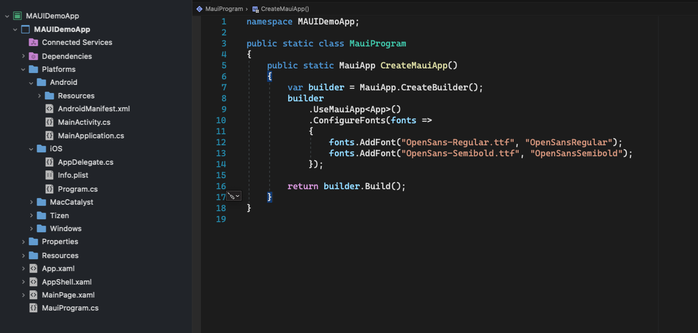

# **Build MAUI control for AutoNavi map  - Custom Controls**

We know that MAUI is a solution for developing cross-platform applications, and applications such as iOS, Android, Windows, macOS, Linux, Tizen, etc. can be developed directly with C#. Then in this framework, in addition to using the underlying custom UI controls, what if we want to use third-party controls such as AutoNavi maps? Next, I will introduce it to you.

If you haven't learned about native library bindings, you can go to the following links to learn related content:

*About making a AutoNavi map for iOS / Android MAUI controls (iOS native library binding)*

https://github.com/kinfey/AMapMAUIControls/blob/main/tutorial/en/01.iOSBinding.md

*Make an iOS / Android MAUI control for AutoNavi map (Android native library binding)*

https://github.com/kinfey/AMapMAUIControls/blob/main/tutorial/en/02.DroidBinding.md

In the above two examples, we learned to bind the native Aode's iOS / Android SDK, and also used .NET for iOS and .NET for Android to call. But using MAUI means changing the calling method, writing one-time multi-platform use. To achieve this effect, first look at the MAUI infrastructure.
<br/>


<br/>

We can clearly see that in addition to the public xmal files, MAUI actually puts some platform-specific settings into the Platforms folder, and the Platforms self-folder is the corresponding platform. We know that the platform interface can be rendered according to different platforms. This is what we often call custom platform controls.

In the preface, we also mentioned that MAUI uses the Handler mode to set the platform interface. If we want to implement a MAUI control of AutoNavi map, the specific architecture is like this
<br/>


<br/>

We need to create a structure as shown above, we need to add a shared file AMap.shared.cs for AMap, this file AMapHandler succeeds ViewHandler.

```csharp

    public interface IAMap : IView
    {
    }


    public class AMap : View, IAMap
    {

    }


    partial class AMapHandler
    {
        public static IPropertyMapper<AMap, AMapHandler> MapMapper = new PropertyMapper<AMap, AMapHandler>(ViewHandler.ViewMapper)
        { };

        public AMapHandler() : base(MapMapper)
        { }
    }

```

Then add the respective platform AutoNavi calls to the Android and iOS folders under Platforms.
<br/>
<div style="text-align:center">

</div>
<br/>


Add the rendering method of AutoNavi map in Android environment to AMap.Android.cs


```csharp

namespace AMap.UI.Apps
{
    public partial class AMapHandler : ViewHandler<IAMap, MapView>
    {
        private AMapHelper _mapHelper;
        private MapView mapView;
        internal static Bundle Bundle { get; set; }

        public AMapHandler(IPropertyMapper mapper, CommandMapper commandMapper = null) : base(mapper, commandMapper)
        {
        }


        protected override MapView CreatePlatformView()
        {

            mapView = new Com.Amap.Api.Maps.MapView(Context);
            return mapView;
        }

        protected override void ConnectHandler(MapView platformView)
        {
            base.ConnectHandler(platformView);


            AMapLocationClient.UpdatePrivacyAgree(Context, true);
            AMapLocationClient.UpdatePrivacyShow(Context, true, true);

            _mapHelper = new AMapHelper(Bundle, platformView);
            mapView = _mapHelper.CallCreateMap();
        }
    }


    class AMapHelper : Java.Lang.Object
    {

        private Bundle _bundle;
        private MapView _mapView;

        public event EventHandler MapIsReady;

        public MapView Map { get; set; }

        public AMapHelper(Bundle bundle, MapView mapView)
        {
            _bundle = bundle;
            _mapView = mapView;
        }

        public MapView CallCreateMap()
        {
            
            _mapView.OnCreate(_bundle);
            return _mapView;
        }


    }

}

```
<br/>


Add the rendering method of AutoNavi map in iOS environment to AMap.iOS.cs

```csharp

namespace AMap.UI.Apps
{
    public partial class AMapHandler : ViewHandler<IAMap, MAMapView>
    {
        public AMapHandler(IPropertyMapper mapper, CommandMapper commandMapper = null) : base(mapper, commandMapper)
        {
        }

        protected override MAMapView CreatePlatformView()
        {
            MAMapView.UpdatePrivacyShow(AMapPrivacyShowStatus.DidShow, AMapPrivacyInfoStatus.DidContain);
            MAMapView.UpdatePrivacyAgree(AMapPrivacyAgreeStatus.DidAgree);


            AMapServices.SharedServices.ApiKey = "";
            AMapServices.SharedServices.EnableHTTPS = true;

            //try
            //{

            MAMapView map = new MAMapView();
            map.SetShowsUserLocation(true);
            map.SetUserTrackingMode(MAUserTrackingMode.Follow);

            return map;
        }

        protected override void ConnectHandler(MAMapView PlatformView)
        { }

        protected override void DisconnectHandler(MAMapView PlatformView)
        {
            if (PlatformView.Delegate != null)
            {
                PlatformView.Delegate.Dispose();
                PlatformView.Delegate = null;
            }

            PlatformView.RemoveFromSuperview();
        }
    }


}

```
<br/>

Here we need to modify the project file of MAUI, here are a few settings to pay attention to

1. Because this control is only for iOS / Android two platforms, so we only keep net6.0-android and net6.0-ios

2. It is recommended to use the AutoNavi SDK under the real machine, especially iOS, you need to specify the version number and the compilation environment. My environment is under Apple silicon, so I also need to set the RuntimeIdentifier, and when compiling, I have spent a lot of time here, you can refer to my self-answered Issue on GitHub https://github.com/xamarin/xamarin-macios/issues/15372
   
```xml

   <PropertyGroup Condition="$(TargetFramework.Contains('-ios'))">
        <RuntimeIdentifier>ios-arm64</RuntimeIdentifier>
        <UseMSBuildEngine>true</UseMSBuildEngine>
        <WarningLevel>4</WarningLevel>
        <MtouchLink>SdkOnly</MtouchLink>
        <SupportedOSPlatformVersion>13.0</SupportedOSPlatformVersion>
        <DeviceSpecificBuild>true</DeviceSpecificBuild>
        <MtouchDebug>true</MtouchDebug>
        <MtouchFastDev>true</MtouchFastDev>
        <MtouchProfiling>true</MtouchProfiling>
        <MtouchUseSGen>true</MtouchUseSGen>
        <MtouchUseRefCounting>true</MtouchUseRefCounting>
        <MtouchFloat32>true</MtouchFloat32>
   </PropertyGroup> 

```

3. Remember to import bindings of native libraries according to the platform


```xml


  <ItemGroup Condition=" '$(TargetPlatformIdentifier)' == 'ios' ">
    <ProjectReference Include="..\iOS.AmapSDK.Foundation\iOS.AmapSDK.Foundation.csproj" /> 
    <ProjectReference Include="..\iOS.AmapSDK.3D\iOS.AmapSDK.3D.csproj" /> 
  </ItemGroup>
  
  <ItemGroup Condition=" '$(TargetPlatformIdentifier)' == 'android' ">
    <ProjectReference Include="..\Droid.AmapSDK\Droid.AmapSDK.csproj" /> 
  </ItemGroup>

```

**To view the full project file, please click this link** 

https://github.com/kinfey/AMapMAUIControls/blob/main/src/AMap.UI.Demo/AMap.UI.Apps/AMap.UI.Apps.csproj

on't forget to set some platform-specific settings, you can

*For iOS settings*

https://github.com/kinfey/AMapMAUIControls/blob/main/src/AMap.UI.Demo/AMap.UI.Apps/Platforms/iOS/Info.plist


*For Android settings*

https://github.com/kinfey/AMapMAUIControls/blob/main/src/AMap.UI.Demo/AMap.UI.Apps/Platforms/Android/AndroidManifest.xml

The last step is to register on MauiProgram.cs

```csharp

builder
	.UseMauiApp<App>()
	.ConfigureFonts(fonts =>
	{
		fonts.AddFont("OpenSans-Regular.ttf", "OpenSansRegular");
		fonts.AddFont("OpenSans-Semibold.ttf", "OpenSansSemibold");
	})
    .ConfigureMauiHandlers(handlers =>
    {
        handlers.AddHandler(typeof(AMap), typeof(AMapHandler));
	});

```
<br/>

Choose to compile and run to see that the AutoNavi map can finally run in the MAUI environment


<br/>

<div style="text-align:center">
&nbsp; &nbsp;&nbsp;&nbsp;&nbsp;   
</div>
<br/>


## **Summary**
<br/>

For many people, or they are initially exposed to MAUI, in fact, there is still a long way to go to do cross-platform well. I hope that through this series of articles, I can give some help to some third-party manufacturers and developers, and provide MAUI support as soon as possible. Only in this way can this new technology be injected with vitality.


### **More**
<br/>


1. Learn about MAUI through Microsoft Docs https://aka.ms/Docs.MAUI
2. Learn MAUI through Microsoft Learn https://aka.ms/Learn.MAUI
3. Learn ViewHandler to customize MAUI components, please click to visit this link https://docs.microsoft.com/zh-cn/dotnet/maui/user-interface/handlers/customize


